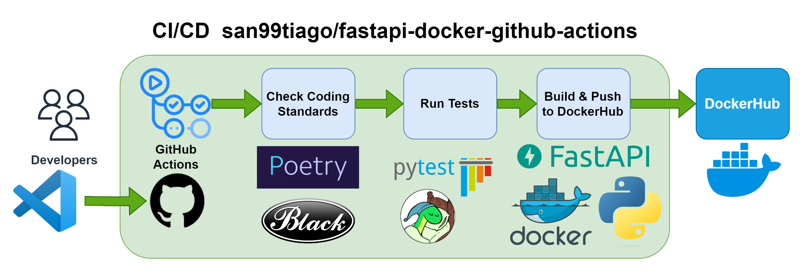

## FASTAPI-DOCKER-GITHUB-ACTIONS


 <br>

## Overview 🔮

Welcome to the FastAPI-Docker-GitHub-Actions Lab! This repository serves as an educational example of a CI/CD project that demonstrates the usage of GitHub Actions for deploying a simple FastAPI server. Key components include:

- Source Code: [Python Runtime](https://www.python.org)
- Dependency Management: [Python Poetry](https://python-poetry.org)
- Web Framework: [FastAPI](https://fastapi.tiangolo.com)
- Containerization Tools: [Docker](https://www.docker.com) and [Docker-Compose](https://docs.docker.com/compose/)
- Testing: [PyTest Framework](https://docs.pytest.org/) and [Coverage](https://coverage.readthedocs.io/en/latest/)
- Artifact Repository: [DockerHub](https://hub.docker.com)
- Continuous Integration/Continuous Delivery (CI/CD): [GitHub Actions](https://github.com/features/actions)

## Usage 👻

The core idea is to have a CI/CD pipeline that illustrates the automation with Continuous Integration, however, you can follow these steps to configure/run the project locally:

### Clone the repository

Begin by cloning this repository to your local machine:

```bash
git clone https://github.com/san99tiago/fastapi-docker-github-actions
cd fastapi-docker-github-actions
```

### Configure Python Dependencies with Poetry

To manage Python dependencies and create a virtual environment, install [Poetry](https://python-poetry.org) following the instructions for your preferred installation method:

- https://python-poetry.org/docs/

Once Poetry is installed, execute the following commands for its setup:

```bash
poetry shell
poetry install
```

### Run the Server Locally with Uvicorn

To run the FastAPI server with Uvicorn, use the following command:

```bash
poe fastapi-local
```

### Run the Server Locally with Docker-Compose

For an easy way to run the FastAPI server as a Docker container using Docker-Compose, use the following commands:

```bash
# Start the service
poe fastapi-docker-up

# Stop the service
poe fastapi-docker-down
```

### Validate the Server

After running the server using the previous commands, open your preferred tool for making API requests and try the following REST-API endpoints:

- `[GET]`: http://127.0.0.1:8000/
- `[GET]`: http://127.0.0.1:8000/status

## Special thanks

A big thank you to all the dedicated contributors who have made the open-source projects used in this repository possible. <br>

## Author :musical_keyboard:

### Santiago Garcia Arango

This repository's content is inspired by multiple online resources. Please feel free to use it as a guide for your future projects.! <br>

<table border="1">
    <tr>
        <td>
            <p align="center"></p>
        </td>
        <td>
            <p align="center">As a Curious DevOps Engineer, I am deeply passionate about implementing cutting-edge cloud-based solutions on AWS.<br> I firmly believe that today's greatest challenges must be solved by the expertise of individuals who are truly passionate about their work.
            </p>
        </td>
    </tr>
</table>

## LICENSE

Copyright 2023 Santiago Garcia Arango
